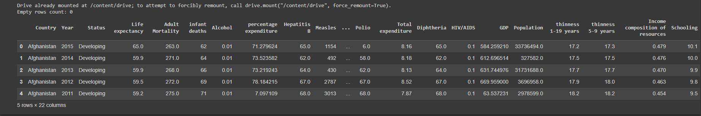
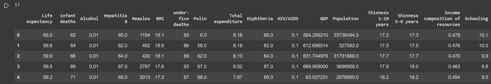
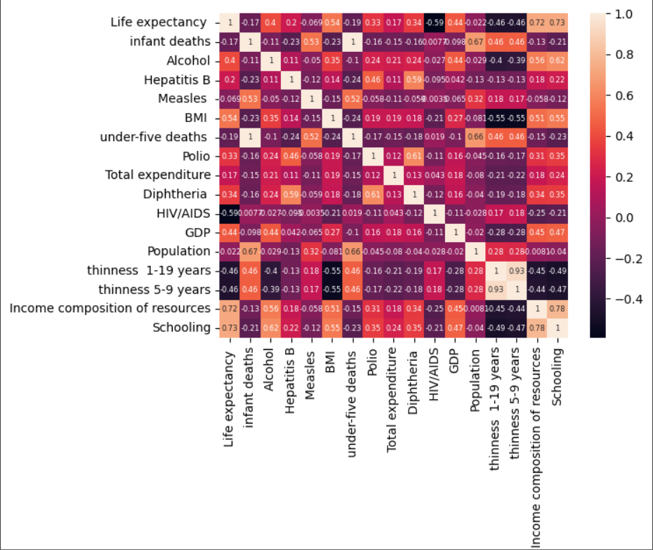
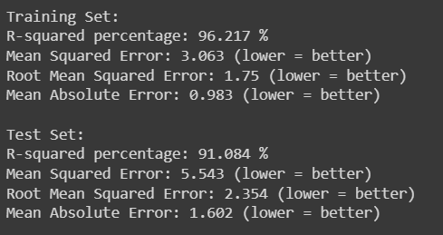
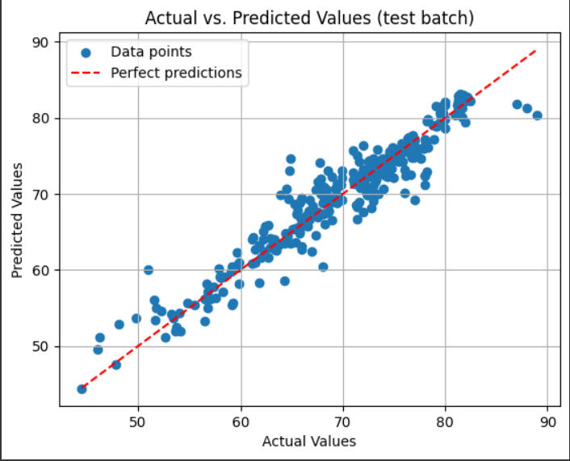
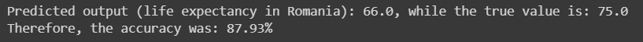

## Description
Applying Support Vector Regression on a dataset to estimate life expectancy in a certain country  
Project done for Artificial Intelligence class at ACIEE UGAL  

# What it does
## Drop the unnecessary columns
Country, Year, Status, Adult Mortality, percentage expenditure  
Then show the dataset  

## Final columns

## Heatmap of correlation

## Print performance metrics
Here's where the svr model is created and trained. The metrics are shown on both the training set and testing set.

## Plot the scatter plot

## Testing on Romania

